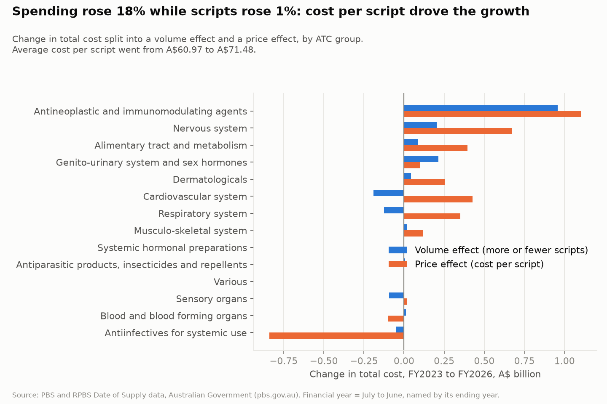
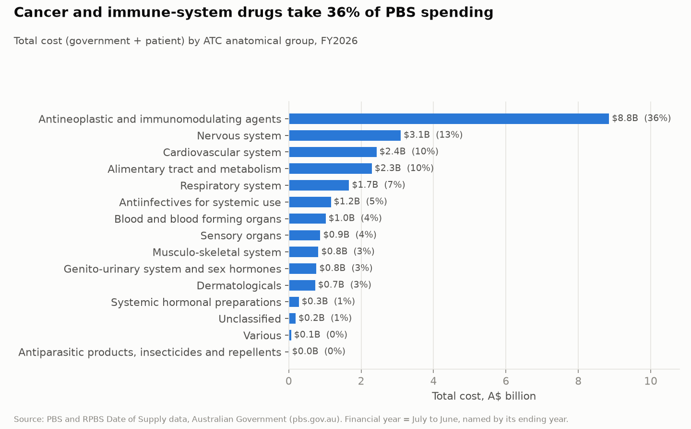
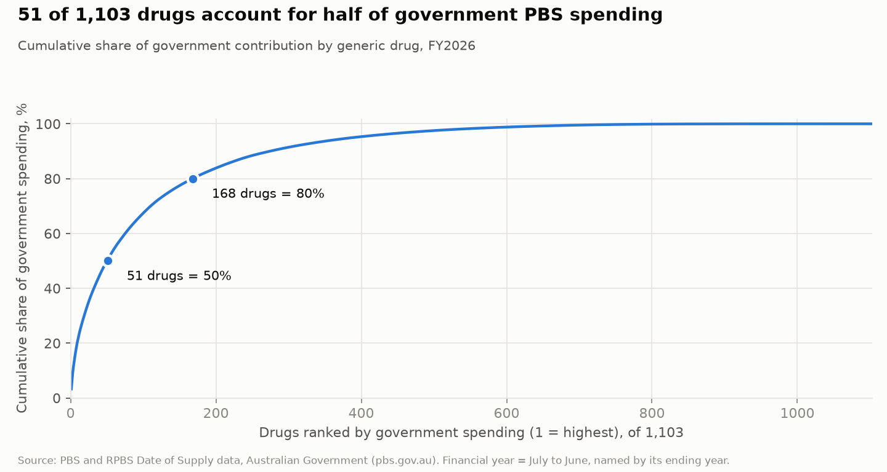
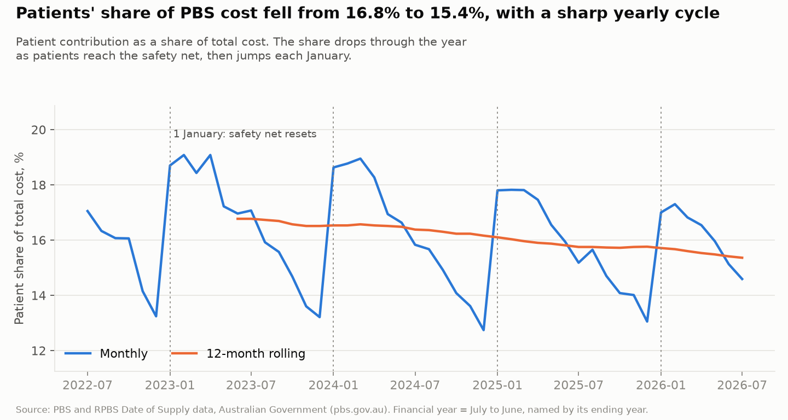
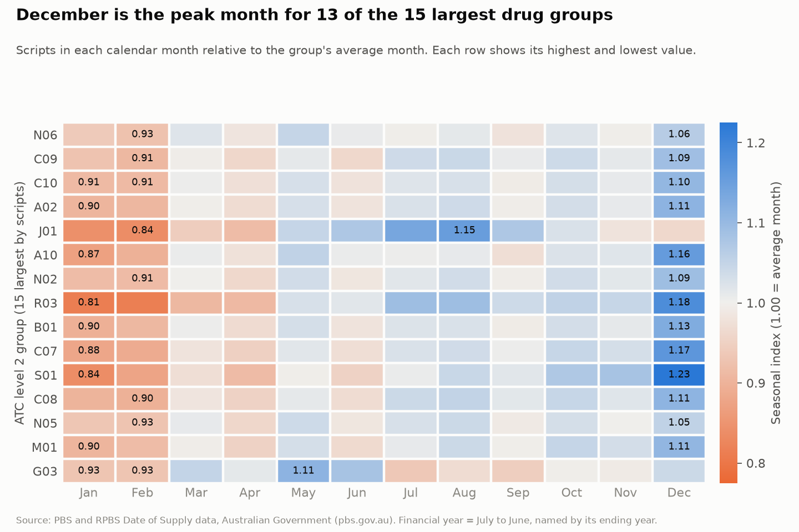

# Australian PBS Prescription Spending Analysis (FY2023–FY2026)

A SQL analysis of four years of Australian Pharmaceutical Benefits Scheme (PBS) prescription data:
1.16 million rows of public government data, modelled as a star schema in PostgreSQL and used to
answer five questions about where the money goes, who pays, and what drives the growth.

**Stack:** PostgreSQL 16 · SQL (window functions, CTEs) · Python (pandas, matplotlib) · Streamlit

**Dashboard:** run `streamlit run app/Home.py` (see [How to reproduce](#how-to-reproduce))

## Key findings

**1. Spending grew 18% in three years while script volume grew 1%.**
Total cost rose from A$20.5B (FY2023) to A$24.2B (FY2026). A price–volume decomposition attributes
A$3.56B of the A$3.75B increase to a higher average cost per script (A$60.97 → A$71.48) and only
A$0.19B to more scripts.



**2. Cancer and immune-system drugs take 36% of all spending.**
ATC group L (antineoplastic and immunomodulating agents) cost A$8.8B in FY2026 from only 6.8 million
scripts, about 2% of all scripts. Cardiovascular drugs are the reverse: the most scripts (100.6 million)
but 10% of cost.



**3. Half of government spending goes to 51 drugs.**
Of 1,103 generic drugs supplied in FY2026, 51 account for 50% of government spending and 168 for 80%.
The top of the list is dominated by high-cost specialty medicines: government cost per script ranges
from A$65 (apixaban) to over A$20,000 (a cystic fibrosis therapy) within the top 20.



**4. Patients' share of cost is falling, and follows a strong yearly cycle.**
The 12-month rolling patient share fell from 16.8% to 15.4%. Within each year the share drops from
about 18–19% in January to about 13% in December as patients reach the PBS Safety Net, then resets
on 1 January. For general patients, the share of scripts priced under the co-payment fell from 76%
(2025) to 70% (January–July 2026), which coincides with the general co-payment cut to A$25 on
1 January 2026.



**5. December is the peak month for 13 of the 15 largest drug groups.**
The seasonal pattern is driven mainly by the scheme's rules rather than by illness: scripts peak in
December (index up to 1.23) and fall in January (down to 0.81), in step with the Safety Net cycle.
Systemic antibacterials (J01) are the exception, peaking in the Australian winter (August, 1.15).



Findings 4 and 5 describe timing that matches known policy dates. The data cannot prove that the
policies caused the changes.

## Data

| | |
|---|---|
| Source | [PBS and RPBS Section 85 Date of Supply data](https://www.pbs.gov.au/info/statistics/dos-and-dop/dos-and-dop), Australian Government |
| Downloaded | 4 October 2026 |
| Coverage | July 2022 – July 2026 (49 months); four full financial years, FY2023–FY2026 |
| Size | 1,160,293 rows; 7,456 PBS item codes; 1,171 generic drug names |
| Grain | month × item code × patient category × program × script type |

Things to know about the data:

- It is aggregated. There are no patient-level records, so this project analyses totals, structure and
  trends, not individual behaviour.
- The Australian financial year runs July to June. Here FY2024 means July 2023 – June 2024. Yearly
  comparisons use only financial years with all 12 months (July 2026 is excluded from them).
- Costs are in Australian dollars. Total cost = patient contribution + government contribution.

## Data model

A star schema with one fact table and four dimension tables ([sql/02_schema.sql](sql/02_schema.sql)).

| Table | Rows | Content |
|---|---|---|
| `fact_supply` | 1,160,293 | scripts and dollar amounts at the grain above |
| `dim_month` | 49 | month, calendar year, financial year |
| `dim_item` | 7,456 | drug name, form/strength, ATC codes at levels 1, 2 and 5 |
| `dim_atc1` | 15 | the 14 WHO ATC anatomical groups, plus "Unclassified" |
| `dim_patient_cat` | 8 | patient category, scheme group, safety-net flag |

Design choices:

- Money is stored as `numeric`, not float. The source file carries floating-point noise
  (e.g. `43774.5899999999`), which is rounded to cents on load so that sums are exact.
- ATC classification lives on the item dimension, so spending can be rolled up to any ATC level
  without touching the fact table.
- ATC codes in the source have different lengths (1, 4, 5 or 7 characters). Level 2 is filled only
  when the code is long enough; 30 item codes with no usable ATC code are grouped as "Unclassified".

## Data quality

Nine checks in [sql/03_quality_checks.sql](sql/03_quality_checks.sql), all run before the analysis.

| # | Check | Result |
|---|---|---|
| 1 | Row counts: converter output = staging = fact | 1,160,293 at each step |
| 2 | Non-numeric values in numeric columns | 0 |
| 3 | Missing values in key columns | 0 |
| 4 | Category values match the PBS explanatory notes | yes; no "UK" patient category appears |
| 5 | Duplicate rows at the fact grain | 0 |
| 6 | Item codes mapped to more than one drug name or ATC code | 0 |
| 6b | Items missing from the PBS item map / unclassified ATC | 2 / 30 of 7,456 |
| 7 | Missing months | 0 |
| 8 | Total cost ≠ patient + government contribution | 0 rows |
| 9 | Negative values, or government cost on under-co-payment scripts | 0 |

Two problems were found and fixed while loading: the workbook splits the data across five sheets
(one per financial year), and the item map file is Windows-1252 encoded, which PostgreSQL rejects.

## Analysis

| # | Question | Method | SQL |
|---|---|---|---|
| 1 | Which drug groups cost the most and grow fastest? | share of year, year-on-year growth with `LAG`, `RANK` | [05](sql/05_a1_category_spend.sql) |
| 2 | How is cost split between government and patients? | 12-month rolling window, `FILTER` aggregates | [06](sql/06_a2_burden_share.sql) |
| 3 | How concentrated is government spending? | running total over ranked drugs (Pareto) | [07](sql/07_a3_concentration.sql) |
| 4 | Which drug groups are seasonal? | seasonal index, window over aggregates | [08](sql/08_a4_seasonality.sql) |
| 5 | Is growth driven by volume or by cost per script? | price–volume decomposition | [09](sql/09_a5_price_volume.sql) |

The price–volume decomposition splits the change in cost exactly into two parts, where Q is scripts
and P is cost per script:

```
C1 - C0 = (Q1 - Q0) * P0     volume effect
        + (P1 - P0) * Q1     price effect
```

At group level the "price effect" includes changes in the mix of drugs, not only price changes.

## Query optimisation

Median of three runs with `EXPLAIN (ANALYZE, BUFFERS)`
([10a](sql/10a_baseline.sql), [10b](sql/10b_indexes.sql), [10c](sql/10c_after.sql)).

| Query | Before | After | What changed |
|---|---|---|---|
| A: one drug's monthly trend | 98.9 ms | 2.8 ms | composite index on `(item_code, month_key)` |
| B: yearly totals by drug group, on the fact table | 307.4 ms | 251.4 ms | nothing useful: the query reads almost every row, so an index cannot help |
| B: same result from a materialised view | 307.4 ms | 35.4 ms | pre-aggregation from 1,160,293 to 136,567 rows |

The index makes the selective query about 36 times faster and leaves the full-table aggregate
unchanged. The aggregate is fixed by pre-aggregating, which makes it about 9 times faster.

## How to reproduce

Requires PostgreSQL 16 and Python 3.10+.

```bash
# 1. Download from the PBS page linked above into data/raw/:
#    the monthly Date of Supply report (XLSX) and the item drug map (CSV)

pip install -r requirements.txt
createdb pbs

# 2. Convert and clean the source files
python scripts/xlsx_to_csv.py data/raw/dos-jul-2022-to-jul-2026.xlsx data/pbs_dos.csv
python scripts/clean_item_map.py data/raw/pbs-item-drug-map.csv data/item_map.csv

# 3. Load, model and check
psql pbs -f sql/01_staging.sql
psql pbs -f sql/02_schema.sql
psql pbs -f sql/03_quality_checks.sql
psql pbs -f sql/04_views.sql

# 4. Baseline timings, then indexes and the materialised view
psql pbs -f sql/10a_baseline.sql
psql pbs -f sql/10b_indexes.sql
psql pbs -f sql/10c_after.sql

# 5. Run the analyses, export results, draw figures, open the dashboard
python scripts/export_results.py
python scripts/make_figures.py
streamlit run app/Home.py
```

## Limitations

- No patient-level data: no cohort, adherence or demographic analysis is possible.
- Script counts are not the same as medicine use. Since September 2023, 60-day prescriptions let one
  script cover twice the supply for some medicines, which lowers script counts and raises cost per
  script without any change in use. This affects every comparison based on script counts,
  including findings 1 and 5.
- Costs are as published. The PBS notes state that expenditure on two drugs (nusinersen and
  onasemnogene abeparvovec) excludes manual payments, and the retail mark-up is a formula value.
- The seasonal index is not de-trended, so groups with strong growth are slightly overstated in the
  later months of the financial year.
- The analysis shows what changed and when. It does not establish causes.

## Policy dates referred to above

- 1 January 2023: general patient co-payment reduced from A$42.50 to A$30.00
  ([PBS Expenditure and Prescriptions Report 2023–24](https://www.pbs.gov.au/info/statistics/expenditure-prescriptions/expenditure-prescriptions-report-1-july-2023-30-june-2024)).
- 1 September 2023: 60-day prescriptions begin (stage 1), with stages 2 and 3 on 1 March and
  1 September 2024 (same report).
- 1 January 2026: general patient co-payment reduced from A$31.60 to A$25.00
  ([Parliament of Australia, Bills Digest](https://www.aph.gov.au/Parliamentary_Business/Bills_Legislation/bd/bd2526/26bd011)).

Data source: Australian Government Department of Health, Disability and Ageing, PBS statistics.
